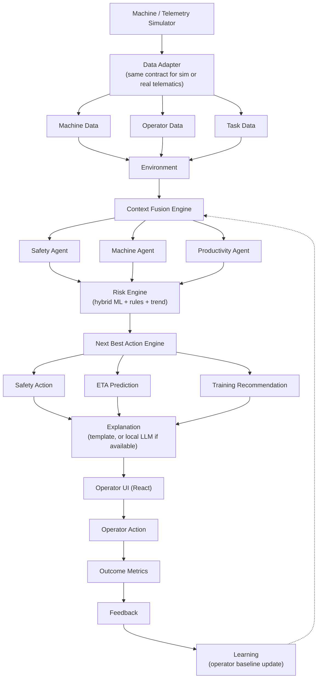

# CAT Operator Intelligence

**Closed-Loop Operator Intelligence for CAT Machinery** — a local-first, closed-loop AI
decision-support platform that fuses machine, operator, task, safety and environmental data to
identify abnormal operational behavior, estimate task outcomes, detect emerging risk, recommend the
operator's next best action, personalize training, and measure intervention outcomes.

Built for the Caterpillar / CAT Digital campus hiring hackathon (24-hour, ₹0 budget, no physical
hardware, local-first laptop execution).

> Core principle: **Observe → Understand → Predict → Prioritize → Recommend → Act → Measure → Learn**

Full product/technical specification: [CAT_Operator_Intelligence_Coding_Context.md](CAT_Operator_Intelligence_Coding_Context.md)

## Status

Phases 0–10 of the build plan are complete and tested (backend: 78 passing tests; frontend: all
5 screens verified against the live backend in-browser). See commit history for phase-by-phase
progress.

## Tech Stack

- **Frontend:** React + Vite + TypeScript, Tailwind CSS, Recharts, lucide-react
- **Backend:** Python, FastAPI, Uvicorn, Pydantic, WebSockets
- **Database:** SQLite
- **Data/ML:** Pandas, NumPy, scikit-learn, Joblib (Isolation Forest anomaly detection, Random
  Forest task-ETA regression, rolling-statistics machine health, hybrid rule+ML risk engine)
- **GenAI (optional):** Ollama + a small local quantized model (e.g. `qwen2.5:1.5b`), with a
  deterministic template fallback that the app never depends on Ollama to function without

## Architecture



The system is a **decision-support layer**, not a machine-control system: it never directly controls
excavator movement, hydraulics, engine, or brakes. It provides alerts, context, predictions,
recommendations and training — the human operator remains in control.

## Repository Layout

```
backend/
  app/
    routers/       REST endpoints (machines, operators, tasks, telemetry, safety, health,
                    predictions, training, incidents, recommendations, shift, simulation)
    ws/             WebSocket telemetry stream
    ml/             Model A (anomaly/IsolationForest), B (ETA/RandomForest),
                    C (machine health), D (hybrid risk engine)
    agents/         Safety / Machine / Productivity / Training agents + orchestrator
    context/        Context Fusion Engine, Next Best Action Engine, explainability,
                    optional local-LLM explanation with template fallback
    simulator/      Telemetry simulator + scripted 10-stage demo scenario
    data_gen/       Synthetic dataset generator (causal relationships, 80-90% normal /
                    10-20% abnormal scenarios)
  tests/            78 pytest tests covering datasets, API, ML, context engine, NBA,
                    live simulation wiring, LLM fallback, training loop, and a full
                    Definition-of-Done end-to-end replay
frontend/
  src/pages/        Dashboard, Live Operation, Safety Center, Training Hub, Shift Intelligence
  src/components/   Shared UI (StatCard, NBACard, RiskTrendChart, TaskCard, StatusBadge, Layout)
  src/lib/          REST client, WebSocket hook, shared types
```

## Running Locally

**Backend** (Python 3.11+):
```bash
cd backend
python -m venv .venv
.venv/Scripts/pip install -r requirements.txt      # or .venv/bin/pip on macOS/Linux
.venv/Scripts/python -m app.ml.train_models         # trains + saves ML artifacts
.venv/Scripts/python -m uvicorn app.main:app --port 8000
```

**Frontend** (Node 18+):
```bash
cd frontend
npm install
npm run dev
```

Open the frontend (default `http://localhost:5173`), go to **Live Operation**, and click
**Start Demo** to run the scripted 10-stage scenario end-to-end — telemetry streams over
WebSocket, risk trend and Next Best Action update live, matching the demo scenario in the spec.

The whole system runs offline on a laptop — no cloud dependency, no GPU required, and an optional
local LLM (Ollama) only improves explanation phrasing, never safety/priority decisions.
