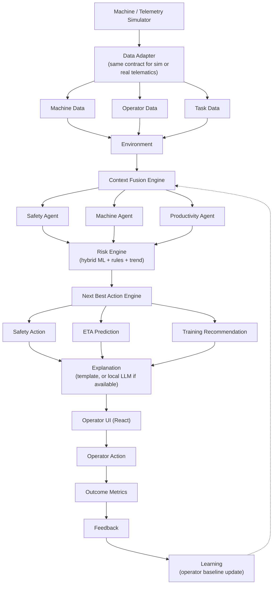
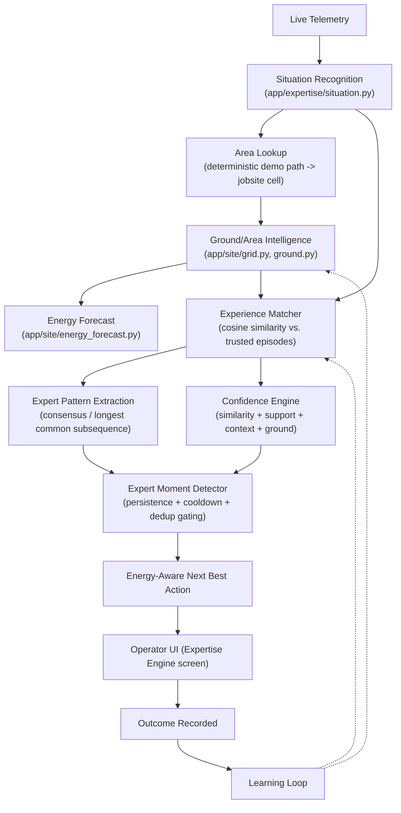

# CAT Operator Intelligence

**Closed-Loop Operator Intelligence for CAT Machinery** — a local-first, closed-loop AI
decision-support platform that fuses machine, operator, task, safety and environmental data to
identify abnormal operational behavior, estimate task outcomes, detect emerging risk, recommend the
operator's next best action, personalize training, and measure intervention outcomes.

Built for the Caterpillar / CAT Digital campus hiring hackathon (24-hour, ₹0 budget, no physical
hardware, local-first laptop execution).

> Core principle: **Observe → Understand → Predict → Prioritize → Recommend → Act → Measure → Learn**

Full product/technical specification: [CAT_Operator_Intelligence_Coding_Context.md](CAT_Operator_Intelligence_Coding_Context.md)

This project has since been extended into the **CAT Expertise Engine** (see the dedicated section
below) — a second intelligence layer built on top of the original system, following
[CAT_Expertise_Engine_Claude_Code_Prompt.md](CAT_Expertise_Engine_Claude_Code_Prompt.md).

## Status

All planned phases (0–11) of the original build are complete and tested, and the CAT Expertise
Engine extension is layered on top without removing or breaking anything: 136 passing backend
tests total (datasets, API, ML models, context engine, Next Best Action, live simulation wiring,
optional LLM explanation, adaptive training loop, shift intelligence, reliability/fault-injection
tests, and the new situation-recognition / ground-intelligence / experience-matching /
expert-moment / learning-loop tests), plus all 7 frontend screens (the original 5 plus Expertise
Engine and Site Map) verified end-to-end against the live backend in-browser, in both dark and
light theme, including the full scripted 10-stage demo scenario running live over WebSocket with
the Expertise Engine evaluating every tick alongside the original risk/NBA pipeline. See commit
history for phase-by-phase progress.

## Tech Stack

- **Frontend:** React + Vite + TypeScript, Tailwind CSS, Recharts, lucide-react
- **Backend:** Python, FastAPI, Uvicorn, Pydantic, WebSockets
- **Database:** SQLite
- **Data/ML:** Pandas, NumPy, scikit-learn, Joblib (Isolation Forest anomaly detection, Random
  Forest task-ETA regression, rolling-statistics machine health, hybrid rule+ML risk engine)
- **GenAI (optional):** Ollama + a small local quantized model (e.g. `qwen2.5:1.5b`), with a
  deterministic template fallback that the app never depends on Ollama to function without

## Architecture



The system is a **decision-support layer**, not a machine-control system: it never directly controls
excavator movement, hydraulics, engine, or brakes. It provides alerts, context, predictions,
recommendations and training — the human operator remains in control.

## CAT Expertise Engine

> **Bringing the right experience to the operator at the right moment.**

### Problem

Experienced operators build up years of situational knowledge — how a machine behaves in
different ground conditions, when to reposition, how to recover from a poor digging approach —
that mostly lives in the operator's head, not in the machine. When that operator moves on, the
knowledge goes with them.

### Existing Caterpillar technologies we complement

Caterpillar already has Smart Mode, Operator Coaching, Grade Assist, Cat AI Assistant, and
VisionLink. This layer is deliberately **not** another generic anomaly dashboard, chatbot, or
automatic Power/Eco switch — those are already solved. Its job is narrower and specific:

### Our innovation

> Situational experience retrieval, combined with a jobsite ground/area memory and an
> energy-aware forecast, so the machine can say *"this situation, and this part of the site,
> resembles conditions where experienced operators succeeded with a specific sequence"* — and
> say nothing when it can't honestly claim that.

### Architecture

The original loop (Observe → Understand → Predict → Prioritize → Recommend → Act → Measure →
Learn) is extended, not replaced:



- **Machine Memory** — `app/expertise/episodes.py` + `matcher.py`: a pool of expert episodes
  (successful and unsuccessful), retrieved by similarity to the current situation.
- **Site Memory** — `app/site/grid.py` + `ground.py`: an 8x8 jobsite grid that starts mostly
  unmapped and grows more confident about each area's ground condition as the machine works
  through it (`GET /site/map`, `GET /site/cells/{id}`).
- **Situation Recognition** — `app/expertise/situation.py`: rule-based classification (e.g.
  `HIGH_RESISTANCE_DIGGING`) from a combination of signals, not a single threshold.
- **Expert Moment** — `app/expertise/moment_detector.py`: only speaks up when the situation is
  meaningful, has persisted, has reliable supporting experience, and hasn't just been said
  (cooldown + dedup) — see spec section 30.
- **Ground Intelligence** — never claims to detect exact soil composition; always reports an
  `estimated_material` with an explicit confidence, and says `UNKNOWN` / `NO_RELIABLE_EXPERIENCE_FOUND`
  honestly when observations are too thin (spec sections 18, 32).
- **Energy Intelligence** — `app/expertise/energy.py`: a physics-inspired *estimate*
  (`Energy ∝ hydraulic load × cycle duration × resistance`), always labeled "estimated," never
  presented as measured, and never used to auto-switch machine power modes.
- **Next Best Action** — the Expertise Engine's action-sequence recommendation sits alongside
  (not instead of) the original Context Engine's risk-based NBA; they answer different questions.
- **Learning Loop** — `POST /expertise/outcome` updates the relevant jobsite cell's ground
  memory and, if the outcome was successful and good-quality, stores a new expert episode
  (visible live as rising cell confidence and a growing trusted-episode count).

### API

```text
GET  /expertise/evaluate/{machine_id}   Full situation -> ground -> expert-moment -> NBA evaluation
GET  /expertise/episodes                Trusted expert episode pool (synthetic demo data)
POST /expertise/outcome                 Record an outcome -> updates ground memory + machine memory
GET  /expertise/memory                  Machine memory summary (episode counts by situation)
GET  /expertise/statistics              Site memory summary (areas mapped, unknown areas, ...)

GET  /site/map                          All jobsite cells (for the Site Map screen)
GET  /site/cells/{cell_id}              Full cell detail
GET  /site/ground-estimate/{cell_id}
GET  /site/energy-forecast/{cell_id}
```

The same evaluation also streams live over the existing `/ws/telemetry` WebSocket, nested under
each reading's `recommendation.expertise` field, so the Live Operation screen and the dedicated
Expertise Engine screen both see the same real-time result.

### Demo

Start the demo (Live Operation → Start Demo) — the scripted machine travels a fixed path through
the jobsite grid, entering a moderately-mapped corridor and then a genuinely unmapped
high-resistance hotspot right as the original risk scenario escalates. Visit **Expertise Engine**
in the nav to watch the situation, ground estimate, and expert recommendation update, and use
**Record Successful/Unsuccessful Outcome** to watch that area's confidence and the machine's
trusted-episode count grow live. **Site Map** visualizes the whole jobsite grid and lets you click
any cell for its ground/energy detail.

### Synthetic data disclaimer & limitations

The expert episode pool and the jobsite grid are **synthetic demo data**, explicitly labeled
`"data_source": "synthetic_demo"` in every API response — this project has no real operator
session logs or real ground-truth soil data. Several `OperatingSituation` fields (material
resistance, penetration rate, vibration, cylinder force, bucket/boom/stick angle, jobsite
position) are documented *derivations* from the telemetry fields that are real in this dataset
(hydraulic pressure, engine load, cycle time), never claimed as real sensor readings. A
production system would replace `app/expertise/episodes.py`'s generator with real logged operator
sessions and `app/expertise/demo_path.py`'s fixed path with real machine GPS.

### Future production architecture

```text
Real operator sessions -> Episode store (database, not in-memory)
Real GPS + machine sensors -> Situation + area lookup
Optional real ground-truth (GPR, seismic, ERT) -> higher-confidence ground estimates
Same Confidence Engine / Expert Moment gating / Next Best Action logic
```

## Repository Layout

```
backend/
  app/
    routers/       REST endpoints (machines, operators, tasks, telemetry, safety, health,
                    predictions, training, incidents, recommendations, shift, simulation,
                    expertise, site)
    ws/             WebSocket telemetry stream (carries both the original risk/NBA context
                    and the CAT Expertise Engine evaluation on every tick)
    ml/             Model A (anomaly/IsolationForest), B (ETA/RandomForest),
                    C (machine health), D (hybrid risk engine)
    agents/         Safety / Machine / Productivity / Training agents + orchestrator
    context/        Context Fusion Engine, Next Best Action Engine, explainability,
                    optional local-LLM explanation with template fallback
    expertise/      CAT Expertise Engine: situation recognition, expert episode memory,
                    experience matcher, confidence engine, pattern extraction, expert-moment
                    detector, energy model, and the orchestrating ExpertiseEngine service
    site/           Jobsite Ground Memory: spatial grid, ground estimation/learning loop,
                    area energy forecast
    simulator/      Telemetry simulator + scripted 10-stage demo scenario
    data_gen/       Synthetic dataset generator (causal relationships, 80-90% normal /
                    10-20% abnormal scenarios)
  tests/            136 pytest tests covering datasets, API, ML, context engine, NBA,
                    live simulation wiring, LLM fallback, training loop, reliability, and
                    the CAT Expertise Engine (situation/ground/matching/confidence/pattern/
                    moment-detection/learning-loop)
frontend/
  src/pages/        Dashboard, Live Operation, Safety Center, Training Hub, Shift Intelligence,
                    Expertise Engine, Site Map
  src/components/   Shared UI (StatCard, NBACard, RiskTrendChart, TaskCard, StatusBadge,
                    ThemeToggle, Layout)
  src/lib/          REST client, WebSocket hook, shared types, dark/light theme hook
```

## Running Locally

**Backend** (Python 3.11+):
```bash
cd backend
python -m venv .venv
.venv/Scripts/pip install -r requirements.txt      # or .venv/bin/pip on macOS/Linux
.venv/Scripts/python -m app.ml.train_models         # trains + saves ML artifacts
.venv/Scripts/python -m uvicorn app.main:app --port 8000
```

**Frontend** (Node 18+):
```bash
cd frontend
npm install
npm run dev
```

Open the frontend (default `http://localhost:5173`), go to **Live Operation**, and click
**Start Demo** to run the scripted 10-stage scenario end-to-end — telemetry streams over
WebSocket, risk trend and Next Best Action update live, matching the demo scenario in the spec.
Then visit **Expertise Engine** and **Site Map** to see the CAT Expertise Engine layer (situation
recognition, ground/area intelligence, expert-moment detection and the learning loop) evaluating
the same live stream. A dark/light theme toggle is in the sidebar.

The whole system runs offline on a laptop — no cloud dependency, no GPU required, and an optional
local LLM (Ollama) only improves explanation phrasing, never safety/priority decisions.
